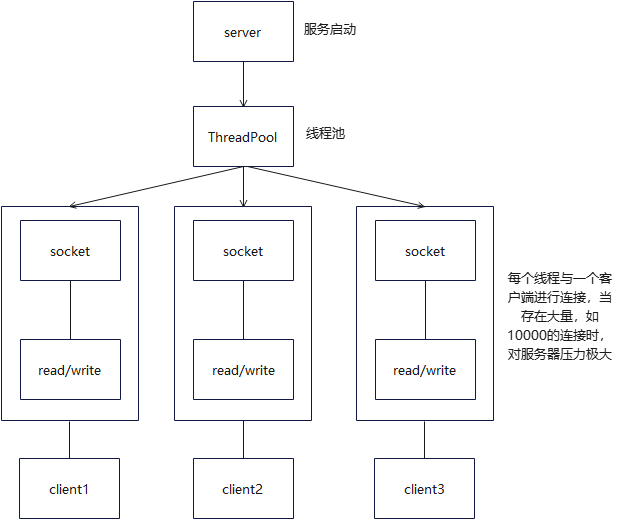

# Netty学习笔记01-理论基础

> 之前学习gRPC，发现RPC这一块算的上我的知识盲点，底层一点都不了解，便对其进行学习
>
> 根据尚硅谷的Netty教程以及Netty In Action 进行学习

## 介绍

**异步**，基于**事件驱动**的网络应用框架，用于创建高性能，高可靠的网络IO程序

- 应用场景

  Dubbo 游戏场景 大数据 

- 资料

  - [尚硅谷Netty视频教程](http://www.atguigu.com/download_detail.shtml?v=260)
  - [尚硅谷 netty 教程代码仓库](https://gitee.com/BinGo2014_admin/NettyPro)
  - [netty-in-action 中文版PDF在线](https://jeff-duan.github.io/downloads/resource/netty/Netty%20in%20Action-%E4%B8%AD%E6%96%87%E7%89%88.pdf)
  - [Netty In Action 中文版代码仓库](https://github.com/ReactivePlatform/netty-in-action-cn)
  - https://github.com/netty/netty
  - https://netty.io/4.1/api/index.html

  视频教程从Java的API开始讲解，而netty-in-action先介绍简单的netty实现，穿插着讲Java的API

  我的学习路线：看视频入门，之后看书补充视频没讲到的，或者不是很详细的内容

  PS：视频里的NIO、reactor模式的原理解释的挺好的，之后再结合代码进行理解，印象深刻

## 三种 IO 服务模型

BIO传统阻塞型 **NIO同步非阻塞** AIO异步非阻塞

### BIO模型



#### 代码

```java
@Slf4j
public class BIOServer {
    public void serverRun() throws IOException {
        // 1.创建线程池
        ExecutorService newCachedThreadPool = Executors.newCachedThreadPool();
        // 2.创建服务
        ServerSocket serverSocket = new ServerSocket(10086);
        log.info("服务端启动端口：10086");

        // 3.死循环监听客户端连接
        while (true) {
            log.info("线程ID=[{}], 线程name=[{}]", Thread.currentThread().getId(), Thread.currentThread().getName());
            // 4.建立连接
            // 侦听要与此套接字建立的连接并接受它。该方法阻塞，直到建立连接。
            // 创建一个新的 Socket s ，如果有安全管理器，则调用安全管理器的checkAccept方法，并使用s.getInetAddress().getHostAddress()和s.getPort()作为其参数，以确保允许操作。
            Socket socket = serverSocket.accept();
            // 5.新建一个线程与客户端通讯
            newCachedThreadPool.execute(new Runnable() {
                @Override
                public void run() {
                    handler(socket);
                }
            });
        }
    }

    // 创建一个新的客户端连接
    public void handler(Socket socket) {
        try {
            log.info("线程ID=[{}], 线程name=[{}]", Thread.currentThread().getId(), Thread.currentThread().getName());
            byte[] bytes = new byte[1024];
            // 获取连接的输入流
            InputStream inputStream = socket.getInputStream();
            // 循环的读取客户端发送的数据
            while (true) {
                log.info("线程ID=[{}], 线程name=[{}]", Thread.currentThread().getId(), Thread.currentThread().getName());
                int read = inputStream.read(bytes);
                // 输出客户端发送的数据
                if (read != -1) {
                    log.info(new String(bytes, 0, read));
                } else {
                    break;
                }
            }
        } catch (Exception e) {
            log.error(e.getMessage());
        } finally {
            log.info("关闭与客户端的连接");
            try {
                // 关闭连接
                socket.close();
            } catch (IOException e) {
                log.error(e.getMessage());
            }
        }
    }
}
```

#### 测试

调用 serverRun() 方法，CMD界面执行以下指令，可多开多个终端观察

```shell
telnet 127.0.0.1 10086
# CTRL+]
欢迎使用 Microsoft Telnet Client
Escape 字符为 'CTRL+]'
Microsoft Telnet> send  这里 是第二个x客户端连接
发送字符串 这里 是第二个x客户端连接
Microsoft Telnet> send this is NO.2 BIO Client
发送字符串 this is NO.2 BIO Client
Microsoft Telnet> close
```

### **NIO 基础**


Client 连接到 Server 时，Server 创建一个 SocketChannel ，并注册到 Selector 上，得到一个SelectionKey

Selector 通过 select() 方法返回有事件发生的通道的个数，进一步得到SelectKey集合，再通过SelectionKey与channel()方法获取对应的SocketChannel


- 一个Selctor对应一个线程
- Selector对应多个 Channel，根据事件 Event 切换 Channel
- 一个 Channel 对应一个 Buffer
- Buffer 是内存块，底层是数组
- Channel、Buffer 是双向的

#### Buffer 

##### 读写

```java
@Slf4j
public class BasicBuffer {
    public static void main(String[] args) {
        // 1.定义一个容量为5的Int缓冲区（初始值为0），赋值
        IntBuffer intBuffer = IntBuffer.allocate(5);
        // capacity() 返回此缓冲区的容量
        for (int i = 0; i < intBuffer.capacity(); i++) {
            intBuffer.put(i * 2);
        }
        // 2.切换读写模式，之前写入，现在被读
        intBuffer.flip();
        // 3.输出
        for (int i = 0; i < intBuffer.capacity(); i++) {
            log.info("第[{}]个元素是[{}]", i, intBuffer.get(i));
        }
    }
}
```

##### 类型读取相对应

```java
/**
 * 类型存取要对应
 */
@Slf4j
public class TypeBufferPutGet {
    public static void main(String[] args) {
        ByteBuffer byteBuffer = ByteBuffer.allocate(1024);
        // 类型化存放
        byteBuffer.putChar('牛');
        byteBuffer.putInt(1023);
        byteBuffer.putLong(1);
        byteBuffer.putShort((short) 4);
        // 反转，进行读
        byteBuffer.flip();
        // 读
        char aChar = byteBuffer.getChar();
        int anInt = byteBuffer.getInt();
        long aLong = byteBuffer.getLong();
        short aShort = byteBuffer.getShort();

        log.info("[{}], [{}], [{}], [{}]", aChar, anInt, aLong, aShort);
    }
}
```

##### 只读Buffer

```java
@Slf4j
public class ReadOnlyBuffer {
    public static void main(String[] args) {
        ByteBuffer byteBuffer = ByteBuffer.allocate(64);
        for (int i = 0; i < byteBuffer.capacity(); i++) {
            byteBuffer.put((byte) i);
        }
        byteBuffer.flip();  // 读写反转
        ByteBuffer readOnlyBuffer = byteBuffer.asReadOnlyBuffer();
        log.info(readOnlyBuffer.getClass().toString());
        while (readOnlyBuffer.hasRemaining()) { // 告诉当前位置和限制之间是否有任何元素。
            log.info(String.valueOf(readOnlyBuffer.get()));
        }
        readOnlyBuffer.put((byte) 1024);    // Exception in thread "main" java.nio.ReadOnlyBufferException
    }
}
```

#### Channel

##### FileChannel 文件输出

```java
public class FileChannelWrite {
    public static void main(String[] args) throws IOException {
        // 创建字符串
        String str = new String("Hello, 了无此生");
        // 定义字节缓冲区
        ByteBuffer byteBuffer = ByteBuffer.allocate(1024);
        // 将字符串按照UTF-8编码格式放到字节缓冲区
        byteBuffer.put(str.getBytes(StandardCharsets.UTF_8));
        // 翻转，从写入变输出
        byteBuffer.flip();
        // 定义文件输出流
        FileOutputStream fileOutputStream = new FileOutputStream("./fileChannel.txt");
        // 返回与此文件输出流关联的唯一FileChannel对象。
        FileChannel fileChannel = fileOutputStream.getChannel();
        // 从给定的缓冲区将字节序列写入此通道
        fileChannel.write(byteBuffer);
        // 关闭连接
        fileChannel.close();
    }
}
```

##### FileChannel 文件读取

```Java
@Slf4j
public class FileChannelRead {
    public static void main(String[] args) throws IOException {
        File file = new File("fileChannel.txt");
        // 文件输入流
        FileInputStream fileInputStream = new FileInputStream(file);
        // 文件Channel
        FileChannel fileChannel = fileInputStream.getChannel();
        // 创建缓冲区
        ByteBuffer byteBuffer = ByteBuffer.allocate((int) file.length());// 返回此抽象路径名表示的文件的长度
        // 从此通道中读取一个字节序列到给定的缓冲区中 channel->buffer
        fileChannel.read(byteBuffer);
        // ByteBuffer -> String 输出
        log.info(new String(byteBuffer.array()));        
        fileChannel.close();
    }
}
```

##### FileChannel 文件复制

```java
public class FileChannelCopy {
    public static void main(String[] args) throws Exception {
        // 定义文件输入输出流
        FileInputStream fileInputStream = new FileInputStream("fileChannel.txt");
        FileOutputStream fileOutputStream = new FileOutputStream("fileChannel-copy.txt");
        // 获取对应的文件输入输出通道
        FileChannel inputStreamChannel = fileInputStream.getChannel();
        FileChannel outputStreamChannel = fileOutputStream.getChannel();

        ByteBuffer byteBuffer = ByteBuffer.allocate(1024);
        while (true) {
            // 很重要的一步，原先的 ByteBuffer 要进行清空，不然会不断的把读的内容加到ByteBuffer里，之后继续写到文件里
            // 清除此缓冲区。位置设置为零，限制设置为容量，标记被丢弃。
            byteBuffer.clear();
            // 读
            int read = inputStreamChannel.read(byteBuffer);
            if (read == -1) { // 读完
                break;
            }
            byteBuffer.flip(); // 反转
            // 写
            outputStreamChannel.write(byteBuffer);
        }
        fileInputStream.close();
        fileOutputStream.close();
    }
}
```

##### FileChannnel.transferFrom() 通道复制 

```java
public class FileChannelTransferFrom {
    public static void main(String[] args) throws Exception {
        FileInputStream fileInputStream = new FileInputStream("C:\\Users\\zwx1160495\\Pictures\\icon/huawei.png");
        FileOutputStream fileOutputStream = new FileOutputStream("C:\\Users\\zwx1160495\\Pictures\\icon/huawei-copy.png");
        FileChannel inputStreamChannel = fileInputStream.getChannel();
        FileChannel outputStreamChannel = fileOutputStream.getChannel();
        
        // 将字节从给定的可读字节通道传输到此通道的文件中。
        outputStreamChannel.transferFrom(inputStreamChannel, 0, inputStreamChannel.size());

        outputStreamChannel.close();
        inputStreamChannel.close();
        fileOutputStream.close();
        fileInputStream.close();
    }
}
```

##### BufferByteMapper 堆外内存修改文件

```java
/**
 * MappedByteBuffer 可让文件直接在内存(堆外内存)修改, 操作系统不需要拷贝一次
 */
public class MappedByteBufferChangeFile {
    public static void main(String[] args) throws Exception {
        // 创建一个随机访问文件流，以读取和写入具有指定名称的文件。
        // 创建一个新的FileDescriptor对象来表示与文件的连接。mode参数指定打开文件的访问模式
        RandomAccessFile randomAccessFile = new RandomAccessFile("fileChannel.txt", "rw");
        FileChannel fileChannel = randomAccessFile.getChannel();
        /*
        mode: 只读、读写、Private(更改不会传播到文件)
        position: 可以修改的起始位置
        size: 映射到内存的大小，即可以修改多少个字节
         */
        MappedByteBuffer mappedByteBuffer = fileChannel.map(FileChannel.MapMode.READ_WRITE, 0, 5);

        mappedByteBuffer.put(0, (byte) 'H');    // 打断点，可发现执行完这一步，文件就发生了变化
        mappedByteBuffer.put(3, (byte) 'y');

        randomAccessFile.close();
    }
}
```

##### Scattering Gathering 读写Buffer数组

```java
/**
 * Scattering：将数据写入到buffer时，可以采用buffer数组，依次写入  [分散]
 * Gathering: 从buffer读取数据时，可以采用buffer数组，依次读
 */
@Slf4j
public class ScatteringAndGathering {
    public static void main(String[] args) throws Exception {
        // 使用 ServerSocketChannel 和 SocketChannel 网络
        ServerSocketChannel serverSocketChannel = ServerSocketChannel.open();
        InetSocketAddress inetSocketAddress = new InetSocketAddress(7000);

        // 绑定端口到socket ，并启动
        serverSocketChannel.socket().bind(inetSocketAddress);

        // 创建buffer数组
        ByteBuffer[] byteBuffers = new ByteBuffer[2];
        byteBuffers[0] = ByteBuffer.allocate(5);
        byteBuffers[1] = ByteBuffer.allocate(3);

        // 等客户端连接(telnet)
        SocketChannel socketChannel = serverSocketChannel.accept();
        int messageLength = 8;   // 假定从客户端接收8个字节
        // 循环的读取
        while (true) {
            int byteRead = 0;
            while (byteRead < messageLength) {
                long read = socketChannel.read(byteBuffers);
                byteRead += read; // 累计读取的字节数
                log.info("byteRead=[{}]", byteRead);
                // 使用流打印, 看看当前的这个buffer的position 和 limit
                Arrays.asList(byteBuffers).stream()
                    .map(buffer -> "position=" + buffer.position() + ", limit=" + buffer.limit())
                    .forEach(log::info);
            }

            // 将所有的buffer进行flip
            Arrays.asList(byteBuffers).forEach(buffer -> buffer.flip());

            // 将数据读出显示到客户端
            long byteWrite = 0;
            while (byteWrite < messageLength) {
                long write = socketChannel.write(byteBuffers); // 累计写的字节数
                byteWrite += write;
            }

            // 将所有的buffer 进行clear
            Arrays.asList(byteBuffers).forEach(buffer -> {
                buffer.clear();
            });

            log.info("byteRead:=[{}] byteWrite=[{}], messageLength=[{}]", byteRead, byteWrite, messageLength);
        }
    }
}
```

#### NIO模型

##### NIOServer

```java
@Slf4j
public class NIOServer {
    public static void main(String[] args) throws Exception {
        // 打开服务器套接字通道。得到一个新的套接字通道
        ServerSocketChannel serverSocketChannel = ServerSocketChannel.open();
        // 绑定端口
        serverSocketChannel.socket().bind(new InetSocketAddress(8848));
        // 设置阻塞状态为 false
        serverSocketChannel.configureBlocking(false);
        // 打开选择器，得到一个新的选择器
        Selector selector = Selector.open();
        // 用给定的选择器注册这个通道，返回一个选择键。
        serverSocketChannel.register(selector, SelectionKey.OP_ACCEPT);
        log.info("注册后的 selectionKey 数量：[{}]", selector.keys().size());

        // 循环等待客户端连接
        while (true) {
            // 一秒内事件数为0，从头开始循环
            if (selector.select(1000) == 0) {
                log.info("服务器等待了一秒，无连接");
                continue;
            }

            // 有连接，判断是否新建立连接。获取SelectionKey集合，反向获取对应的SocketChannel
            Set<SelectionKey> selectionKeys = selector.selectedKeys();
            Set<SelectionKey> keys = selector.keys();
            log.info("key数量为：[{}]， selectionKey数量为：[{}]", keys.size(), selectionKeys.size());

            Iterator<SelectionKey> keyIterator = selectionKeys.iterator();

            while (keyIterator.hasNext()) {
                SelectionKey selectionKey = keyIterator.next();
                // OP_ACCEPT，是新的客户端连接
                if (selectionKey.isAcceptable()) {
                    SocketChannel socketChannel = serverSocketChannel.accept();
                    log.info("新的SocketChannel：[{}]", socketChannel.hashCode());
                    socketChannel.configureBlocking(false);
                    socketChannel.register(selector, SelectionKey.OP_READ, ByteBuffer.allocate(128));
                }
                if (selectionKey.isReadable()) {  //发生 OP_READ 读客户端发送的数据
                    //通过key 反向获取到对应channel
                    SocketChannel channel = (SocketChannel) selectionKey.channel();
                    //获取到该channel关联的buffer
                    ByteBuffer buffer = (ByteBuffer) selectionKey.attachment();
                    channel.read(buffer);
                    log.info("客户端获取的数据：[{}]", buffer.array());
                }

                // 手动从集合中移动当前的selectionKey, 防止重复操作
                keyIterator.remove();
            }
        }
    }
}
```

##### NIOClient

```java
@Slf4j
public class NIOClient {
    public static void main(String[] args) throws Exception {
        SocketChannel socketChannel = SocketChannel.open();
        socketChannel.configureBlocking(false);	// 非阻塞
        InetSocketAddress inetSocketAddress = new InetSocketAddress("127.0.0.1", 8848);
        if (!socketChannel.connect(inetSocketAddress)) {
            log.info("连接失败！");
            while (!socketChannel.finishConnect()) {
                log.info("刷新连接失败，正在重试");
                Thread.sleep(100);
            }
        }
        String msg = "这里是客户端发送给NIO服务端的消息";
        ByteBuffer byteBuffer = ByteBuffer.wrap(msg.getBytes(StandardCharsets.UTF_8));
        socketChannel.write(byteBuffer);
        System.in.read();   // 读取数据的下个字节，这里是防止程序退出
    }
}
```

### NIO 群聊系统

#### NIO群聊系统服务器

```java
@Slf4j
public class GroupChatServer {
    // 定义属性
    private Selector selector;
    private ServerSocketChannel listenChannel;
    private static final int PORT = 6667;

    // 构造器
    // 初始化工作
    public GroupChatServer() {
        try {
            // 得到选择器
            selector = Selector.open();
            // ServerSocketChannel
            listenChannel = ServerSocketChannel.open();
            // 绑定端口
            listenChannel.socket().bind(new InetSocketAddress(PORT));
            // 设置非阻塞模式
            listenChannel.configureBlocking(false);
            // 将该listenChannel 注册到selector
            listenChannel.register(selector, SelectionKey.OP_ACCEPT);
        } catch (IOException e) {
            log.error(e.getMessage());
        }
    }

    //监听
    public void listen() {
        log.info("监听线程: {}", Thread.currentThread().getName());
        try {
            // 循环处理
            while (true) {
                int count = selector.select();
                if (count > 0) {    // 有事件处理
                    // 遍历得到selectionKey 集合
                    Iterator<SelectionKey> iterator = selector.selectedKeys().iterator();
                    while (iterator.hasNext()) {
                        // 取出selectionKey
                        SelectionKey key = iterator.next();
                        // 监听到 accept
                        if (key.isAcceptable()) {    // 客户端上线
                            SocketChannel sc = listenChannel.accept();
                            sc.configureBlocking(false);
                            // 将该 sc 注册到selector
                            sc.register(selector, SelectionKey.OP_READ);
                            // 提示
                            log.info("{} 上线 ", sc.getRemoteAddress());
                        }
                        if (key.isReadable()) { //通道发送read事件，即通道是可读的状态
                            // 处理读 (专门写方法..)
                            readData(key);
                        }
                        // 当前的key 删除，防止重复处理
                        iterator.remove();
                    }
                } else {
                    log.info("等待....");
                }
            }

        } catch (Exception e) {
            log.error(e.getMessage());
        } finally {
            //发生异常处理....
            log.info("监听线程出错，请检查代码逻辑。。。");
        }
    }

    /**
     * 读取客户端消息
     *
     * @param key 从Selector获取的事件的SelectionKey
     */
    private void readData(SelectionKey key) {
        // 取到关联的channel
        SocketChannel channel = null;
        try {
            // 得到channel
            channel = (SocketChannel) key.channel();
            // 创建buffer
            ByteBuffer buffer = ByteBuffer.allocate(1024);
            int count = channel.read(buffer);
            // 根据count的值做处理
            if (count > 0) {
                // 把缓存区的数据转成字符串
                String msg = new String(buffer.array());
                // 输出该消息
                log.info("form 客户端: " + msg);
                // 向其它的客户端转发消息(去掉自己), 专门写一个方法来处理
                sendInfoToOtherClients(msg, channel);
            }
        } catch (IOException e) {
            try {
                log.info(channel.getRemoteAddress() + " 离线了..");
                // 取消注册
                key.cancel();
                // 关闭通道
                channel.close();
            } catch (IOException e2) {
                log.error(e2.getMessage());
            }
        }
    }

    /**
     * 转发消息给其它客户(通道)
     *
     * @param msg
     * @param self
     * @throws IOException
     */
    private void sendInfoToOtherClients(String msg, SocketChannel self) throws IOException {

        log.info("服务器转发消息中...");
        log.info("服务器转发数据给客户端线程: {}", Thread.currentThread().getName());
        // 遍历 所有注册到selector 上的 SocketChannel,并排除 自己
        for (SelectionKey key : selector.keys()) {
            // 通过 key 取出对应的 SocketChannel
            Channel targetChannel = key.channel();
            // 排除自己
            if (targetChannel instanceof SocketChannel && targetChannel != self) {
                // 转型
                SocketChannel dest = (SocketChannel) targetChannel;
                // 将 msg 存储到buffer
                ByteBuffer buffer = ByteBuffer.wrap(msg.getBytes());
                // 将buffer 的数据写入 通道
                dest.write(buffer);
            }
        }
    }

    public static void main(String[] args) {
        GroupChatServer groupChatServer = new GroupChatServer();
        groupChatServer.listen();
    }

}
```

#### NIO群聊系统客户端

```java
@Slf4j
public class GroupChatClient {
    //定义相关的属性
    private final String HOST = "127.0.0.1"; // 服务器的ip
    private final int PORT = 6667; // 服务器端口
    private Selector selector;
    private SocketChannel socketChannel;
    private String username;

    /**
     * 构造器, 完成初始化工作
     */
    public GroupChatClient() throws IOException {
        selector = Selector.open();
        // 连接服务器
        socketChannel = socketChannel.open(new InetSocketAddress("127.0.0.1", PORT));
        // 设置非阻塞
        socketChannel.configureBlocking(false);
        // 将channel 注册到selector
        socketChannel.register(selector, SelectionKey.OP_READ);
        // 得到username
        username = socketChannel.getLocalAddress().toString().substring(1);
        log.info(username + " is ok...");
    }

    /**
     * 向服务器发送消息
     */
    public void sendInfo(String info) {
        info = username + " 说：" + info;
        try {
            socketChannel.write(ByteBuffer.wrap(info.getBytes()));
        } catch (IOException ioEx) {
            log.error(ioEx.getMessage());
        }
    }

    /**
     * 读取从服务器端回复的消息
     */
    public void readInfo() {
        try {
            int readChannels = selector.select();
            if (readChannels > 0) { // 有可以用的通道
                Iterator<SelectionKey> iterator = selector.selectedKeys().iterator();
                while (iterator.hasNext()) {
                    SelectionKey key = iterator.next();
                    if (key.isReadable()) {
                        //得到相关的通道
                        SocketChannel sc = (SocketChannel) key.channel();
                        //得到一个Buffer
                        ByteBuffer buffer = ByteBuffer.allocate(1024);
                        //读取
                        sc.read(buffer);
                        //把读到的缓冲区的数据转成字符串
                        String msg = new String(buffer.array());
                        System.out.println(msg.trim());
                    }
                }
                iterator.remove(); //删除当前的selectionKey, 防止重复操作
            } else {
                log.info("没有可以用的通道...");
            }
        } catch (Exception e) {
            log.error(e.getMessage());
        }
    }

    public static void main(String[] args) throws Exception {
        //启动我们客户端
        GroupChatClient chatClient = new GroupChatClient();
        //启动一个线程, 每个3秒，读取从服务器发送数据
        new Thread() {
            public void run() {
                while (true) {
                    chatClient.readInfo();
                    try {
                        Thread.currentThread().sleep(3000);
                    } catch (InterruptedException e) {
                        e.printStackTrace();
                    }
                }
            }
        }.start();
        //发送数据给服务器端
        Scanner scanner = new Scanner(System.in);
        while (scanner.hasNextLine()) {
            String s = scanner.nextLine();
            chatClient.sendInfo(s);
        }
    }
}
```

### 零拷贝

- [拷贝原理](https://bbs.huaweicloud.com/blogs/313797)
- [linux零拷贝技术](http://3ms.huawei.com/km/blogs/details/9669515)

没有CPU拷贝

java.nio.FileChannel.transferTo()

在linux下一个transferTo 方法就可以完成传输

在windows 下 一次调用 transferTo 只能发送8m , 就需要分段传输文件, 而且要主要

### AIO

异步输入输出，异步非阻塞

### 对比BIO、NIO、AIO

- [BIO与NIO、AIO的区别](https://blog.csdn.net/skiof007/article/details/52873421)

  同步，阻塞的区别

## Reactor模式

Netty基于Reactor的主从Reactor多线程模式实现NIO

### 单Reactor单线程


#### 方案说明

1. Select 是前面 I/O 复用模型介绍的标准网络编程 API，可以实现应用程序通过一个阻塞对象监听多路连接请求
2. Reactor 对象通过 Select 监控客户端请求事件，收到事件后通过 Dispatch 进行分发
3. 如果是建立连接请求事件，则由 Acceptor 通过 Accept 处理连接请求，然后创建一个 Handler 对象处理连接完成后的后续业务处理
4. 如果不是建立连接事件，则 Reactor 会分发调用连接对应的 Handler 来响应
5. Handler 会完成 Read → 业务处理 → Send 的完整业务流程

结合实例：服务器端用一个线程通过多路复用搞定所有的 IO 操作（包括连接，读、写等），编码简单，清晰明了，但是如果客户端连接数量较多，将无法支撑，前面的 NIO 案例就属于这种模型。

#### 方案优缺点分析

- 优点：模型简单，没有多线程、进程通信、竞争的问题，全部都在一个线程中完成
- 缺点：性能问题，只有一个线程，无法完全发挥多核 CPU 的性能。Handler在处理某个连接上的业务时，整个进程无法处理其他连接事件，很容易导致性能瓶颈
- 缺点：可靠性问题，线程意外终止，或者进入死循环，会导致整个系统通信模块不可用，不能接收和处理外部消息，造成节点故障
- 使用场景：客户端的数量有限，业务处理非常快速，比如 Redis 在业务处理的时间复杂度 O(1) 的情况 

### 单Reactor多线程


#### 方案说明

1. Reactor 对象通过 Select 监控客户端请求事件，收到事件后，通过 Dispatch 进行分发
2. 如果是建立连接请求，则由 Acceptor 通过 accept 处理连接请求，然后创建一个 Handler 对象处理完成连接后的各种事件
3. 如果不是连接请求，则由 Reactor 分发调用连接对应的 handler 来处理（也就是说连接已经建立，后续客户端再来请求，那基本就是数据请求了，直接调用之前为这个连接创建好的handler来处理）
4. handler 只负责响应事件，不做具体的业务处理（这样不会使handler阻塞太久），通过 read 读取数据后，会分发给后面的 worker 线程池的某个线程处理业务。【业务处理是最费时的，所以将业务处理交给线程池去执行】
5. worker 线程池会分配独立线程完成真正的业务，并将结果返回给 handler
6. handler 收到响应后，通过 send 将结果返回给 client

#### 方案优缺点分析

- 优点：可以充分的利用多核 cpu 的处理能力
- 缺点：多线程数据共享和访问比较复杂。Reactor 承担所有的事件的监听和响应，它是单线程运行，在高并发场景容易出现性能瓶颈。也就是说Reactor主线程承担了过多的事

### 主从 Reactor 多线程


==**SubReactor**是可以有**多个**的，如果只有一个SubReactor的话那和单 Reactor 多线程就没什么区别了。==

#### 方案说明

1. Reactor 主线程 MainReactor 对象通过 select 监听连接事件，收到事件后，通过 Acceptor 处理连接事件
2. 当 Acceptor 处理连接事件后，MainReactor 将连接分配给 SubReactor
3. subreactor 将连接加入到连接队列进行监听，并创建 handler 进行各种事件处理
4. 当有新事件发生时，subreactor 就会调用对应的 handler 处理
5. handler 通过 read 读取数据，分发给后面的 worker 线程处理
6. worker 线程池分配独立的 worker 线程进行业务处理，并返回结果
7. handler 收到响应的结果后，再通过 send 将结果返回给 client
8. Reactor 主线程可以对应多个 Reactor 子线程，即 MainRecator 可以关联多个 SubReactor

#### 方案优缺点分析

- 优点：父线程与子线程的数据交互简单职责明确，父线程只需要接收新连接，子线程完成后续的业务处理。
- 优点：父线程与子线程的数据交互简单，Reactor 主线程只需要把新连接传给子线程，子线程无需返回数据。
- 缺点：编程复杂度较高

结合实例：这种模型在许多项目中广泛使用，包括 Nginx 主从 Reactor 多进程模型，Memcached 主从多线程，Netty 主从多线程模型的支持

## Netty模型


### 说明

1. Netty 抽象出两组线程池 ，BossGroup 专门负责接收客户端的连接，WorkerGroup 专门负责网络的读写
2. BossGroup 和 WorkerGroup 类型都是 NioEventLoopGroup
3. NioEventLoopGroup 相当于一个事件循环组，这个组中含有多个事件循环，每一个事件循环是 NioEventLoop
4. NioEventLoop 表示一个不断循环的执行处理任务的线程，每个 NioEventLoop 都有一个 Selector，用于监听绑定在其上的 socket 的网络通讯
5. NioEventLoopGroup 可以有多个线程，即可以含有多个 NioEventLoop
6. 每个 BossGroup下面的NioEventLoop 循环执行的步骤有 3 步
   1. 轮询 accept 事件
   2. 处理 accept 事件，与 client 建立连接，生成 NioScocketChannel，并将其注册到Worker Group某个 NIOEventLoop 上的 Selector
   3. 继续处理任务队列的任务，即 runAllTasks
7. 每个 WorkerGroup NIOEventLoop 循环执行的步骤
   1. 轮询 read，write 事件
   2. 处理 I/O 事件，即在对应 NioScocketChannel 处理 read、write 事件
   3. 处理任务队列的任务，即 runAllTasks
8. 每个 Worker NIOEventLoop 处理业务时，会使用 pipeline（管道），pipeline 中包含了 channel（通道），即通过 pipeline 可以获取到对应通道，管道中维护了很多的处理器。. 
